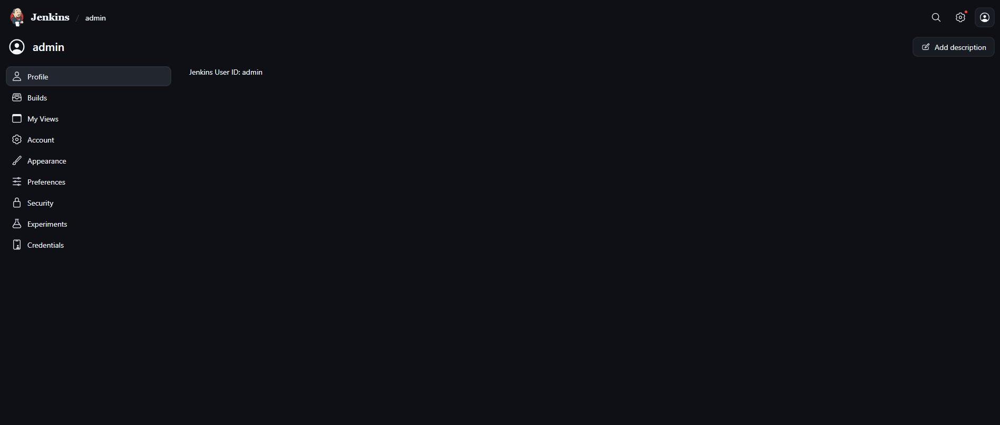
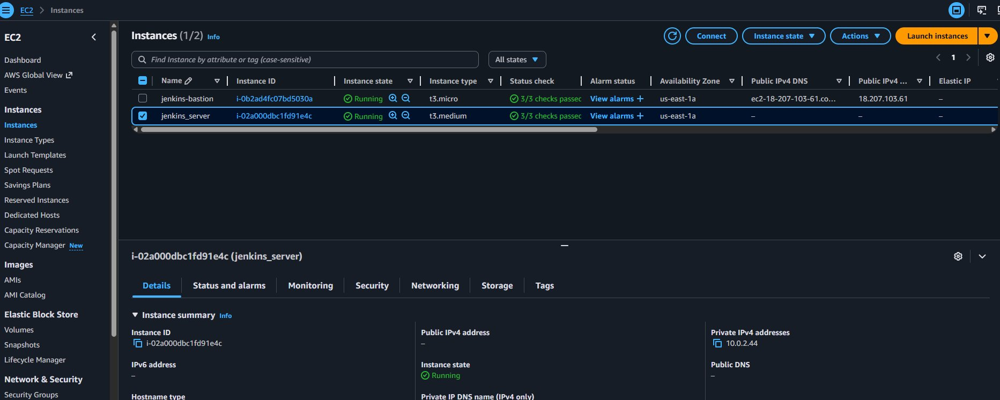
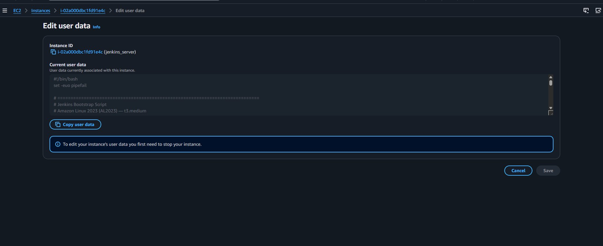
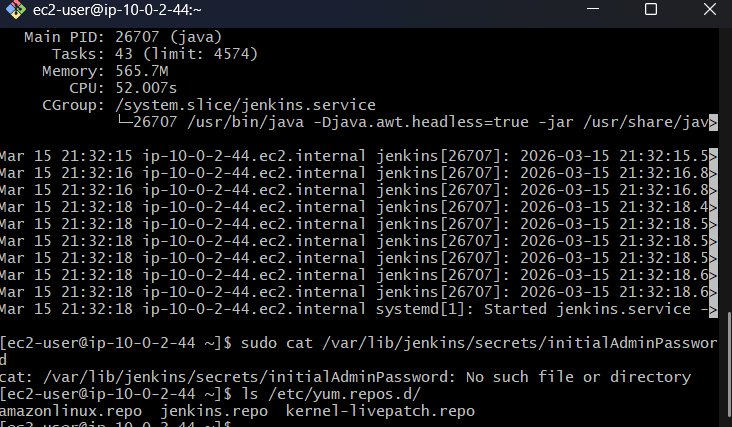

# Jenkins CI/CD Server — Lab Submission
**Student:** Unknown  
**Date:** March 15, 2026  
**Platform:** AWS EC2 | Amazon Linux 2023 | us-east-1


```
Internet
    │
    ▼
Internet Gateway
    │
    ▼
Public Subnet (10.0.1.0/24)
├── Bastion Host (t3.micro) — public IP, port 22 inbound
└── NAT Gateway — Elastic IP, outbound only
    │
    ▼
Private Subnet (10.0.2.0/24)
└── Jenkins Server (t3.medium) — no public IP, port 8080 VPC-internal only
```

---

## Deliverable 1 — Jenkins Server Rebuilt on EC2 Using Java 21

### What Was Done

The Jenkins server was rebuilt as an EC2 instance (`t3.medium`) running Amazon Linux 2023, provisioned entirely through Terraform. The deployment uses a private VPC architecture with a bastion host for secure access — Jenkins has no public IP address and is only reachable by jumping through the bastion.

Java 21 (Amazon Corretto 21) was used instead of Java 17. Java 17 support in Jenkins ends on March 31, 2026. Using Java 21 ensures the server is on the current LTS runtime and will not generate end-of-life warnings.

The bootstrap script installs Java 21 with:

```bash
sudo yum install java-21-amazon-corretto -y
```

### Evidence

**Figure 1 — Jenkins admin profile confirming successful login**



**Figure 2 — EC2 instances console showing jenkins-bastion (t3.micro) and jenkins_server (t3.medium) both running in us-east-1a**



**Figure 3 — EC2 user data panel confirming the bootstrap script is attached to the Jenkins instance**



The Jenkins server has no public IPv4 address (shown as `–` in the console), confirming it sits in the private subnet. The bastion holds the only public IP (`18.207.103.61`).

---

## Deliverable 2 — Automated Plugin Installation (Be a Man)

### What Was Done

All required Jenkins plugins are installed automatically as part of the EC2 bootstrap script, before Jenkins starts for the first time. This means that when Jenkins becomes available for interaction, every plugin is already in place — no manual installation through the UI is required.

### How It Works

The Jenkins 2.x rpm package does not bundle `jenkins-plugin-cli`. Instead, the bootstrap script downloads the **Plugin Installation Manager Tool** jar directly from GitHub and invokes it with Java before starting the Jenkins service:

```bash
sudo wget -q -O /usr/local/bin/jenkins-plugin-manager.jar \
  https://github.com/jenkinsci/plugin-installation-manager-tool/releases/download/2.13.0/jenkins-plugin-manager-2.13.0.jar

sudo java -jar /usr/local/bin/jenkins-plugin-manager.jar \
  --war /usr/share/java/jenkins.war \
  --plugin-file /tmp/plugins.txt \
  --plugin-download-directory /var/lib/jenkins/plugins \
  --jenkins-update-center https://updates.jenkins.io/current/update-center.json \
  --skip-failed-plugins
```

The `--jenkins-update-center` flag is required because the default update center URL returns a `301` redirect that the jar does not follow, causing all plugin downloads to fail silently. Pointing directly to the current index bypasses the redirect.

The `--skip-failed-plugins` flag allows the install to continue if any individual plugin cannot be resolved, rather than failing the entire batch and leaving Jenkins with no plugins.

### Plugin Categories Installed

| Category | Plugins |
|---|---|
| AWS | aws-credentials, pipeline-aws, ec2, amazon-ecs, codedeploy, aws-lambda, aws-codebuild, artifact-manager-s3, aws-secrets-manager-credentials-provider, aws-codepipeline, configuration-as-code-secret-ssm, aws-sam |
| IaC | terraform, kubernetes |
| Google Cloud | google-storage-plugin, google-kubernetes-engine, google-oauth-plugin |
| Security Scanning | snyk-security-scanner, sonar, aqua-security-scanner, aqua-microscanner, aqua-serverless |
| GitHub | github, github-oauth, pipeline-github, pipeline-githubnotify-step |
| Build and Deploy | maven-plugin, pipeline-maven, publish-over-ssh |

### Ordering Matters

The plugin installation block runs after Jenkins is installed but before `systemctl start jenkins`. This is the only valid window — the jar depends on the Jenkins war file being present, and Jenkins must not be running when plugins are written to its plugins directory.

---

## Deliverable 3 — Filesystem Modification: Why, The Problem, and The Fix (BAM 2)

### Why the Filesystem Needs to Be Modified

Amazon Linux 2023 mounts `/tmp` as `tmpfs` — a virtual filesystem backed entirely by RAM. By default, the OS allocates half of total RAM to `/tmp`. On a `t3.medium` with 4GB of RAM, this gives `/tmp` approximately 2GB.

Jenkins uses `/tmp` heavily during plugin installation, build workspace operations, and artifact staging. When 30+ plugins are downloaded and extracted simultaneously during bootstrap, 2GB fills up quickly. When `/tmp` is exhausted, the process dies with no clear error message and Jenkins either fails to start or starts with no plugins installed.

The filesystem must be expanded before Jenkins runs to prevent this failure.

Similarly, AL2023 does not configure swap space by default. Swap acts as an overflow buffer when RAM usage spikes during heavy builds. Without it, the OS will kill the Jenkins process (OOM kill) rather than allow it to exceed available RAM. A 2GB swapfile is created to provide this buffer.

### Why the Original `/tmp` Fix Did Not Persist Across Reboots

The first approach taken was:

```bash
echo 'tmpfs /tmp tmpfs defaults,size=4G 0 0' | sudo tee -a /etc/fstab
sudo mount -o remount /tmp
```

This writes the size override to `/etc/fstab` and applies it immediately. It works — once. The problem is that on AL2023, `/tmp` is not managed by `/etc/fstab`. It is managed by `systemd` through a unit called `tmp.mount`.

When the instance reboots, systemd starts before the fstab mounts are processed. It reads its own unit definition for `tmp.mount`, which specifies the default options, and mounts `/tmp` at 2GB. The fstab entry is never consulted for this mount point because systemd already owns it. The fix disappears on every reboot.

This can be verified by running:

```bash
systemctl cat tmp.mount
```

The output shows systemd's own `Options=` line, which does not include the size override.

### The Persistent Solution — systemd Drop-in

The correct fix is to override the systemd unit directly using a drop-in configuration file. systemd drop-ins are override files placed in a unit-specific directory that systemd merges with the base unit definition at boot time.

```bash
sudo mkdir -p /etc/systemd/system/tmp.mount.d

cat << 'EOF' | sudo tee /etc/systemd/system/tmp.mount.d/size.conf
[Mount]
Options=mode=1777,strictatime,nosuid,nodev,size=4G
EOF

sudo systemctl daemon-reload
sudo systemctl restart tmp.mount
```

This creates `/etc/systemd/system/tmp.mount.d/size.conf` containing a `[Mount]` section that overrides the `Options=` line in the base unit. On every subsequent boot, systemd reads the drop-in automatically and mounts `/tmp` at 4GB. The fix persists permanently without any further intervention.

### Automated in the Bootstrap Script

Both the swap configuration and the `/tmp` expansion are automated in the EC2 user data script and run as steps 2 and 3 of 9, before any Jenkins installation begins:

```bash
# Swap — 2GB swapfile
if [ ! -f /swapfile ]; then
  sudo dd if=/dev/zero of=/swapfile bs=128M count=16
  sudo chmod 600 /swapfile
  sudo mkswap /swapfile
  sudo swapon /swapfile
  echo '/swapfile swap swap defaults 0 0' | sudo tee -a /etc/fstab
fi

# /tmp — 4GB via systemd drop-in
sudo mkdir -p /etc/systemd/system/tmp.mount.d
cat << 'EOF' | sudo tee /etc/systemd/system/tmp.mount.d/size.conf
[Mount]
Options=mode=1777,strictatime,nosuid,nodev,size=4G
EOF
sudo systemctl daemon-reload
sudo systemctl restart tmp.mount
```

Both blocks are idempotent — the swap block checks for the swapfile before creating it, so reprovisioning the instance does not attempt to create a duplicate. The drop-in file is simply overwritten on each run, which is harmless.

**Figure 4 — systemctl status output confirming Jenkins is active and running on the private instance**



The terminal confirms the instance hostname `ip-10-0-2-44` matching the private IP from the Terraform output, and shows Jenkins running under Java via the CGroup process tree.

---

## Summary

| Deliverable | Status | Evidence |
|---|---|---|
| EC2 rebuild with Java 21 | Complete | Figures 1, 2, 3 |
| Automated plugin installation | Complete | Bootstrap script, Figure 3 |
| Filesystem modification — reasoning, persistent fix, automation | Complete | Figure 4, bootstrap script |