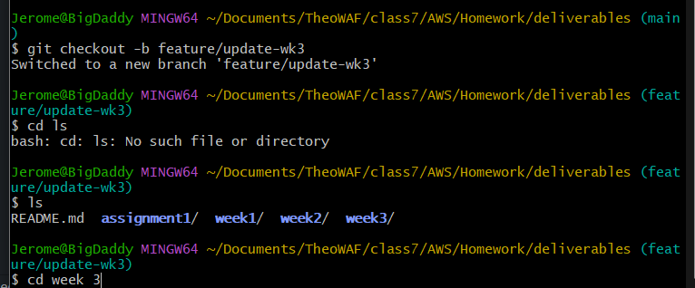
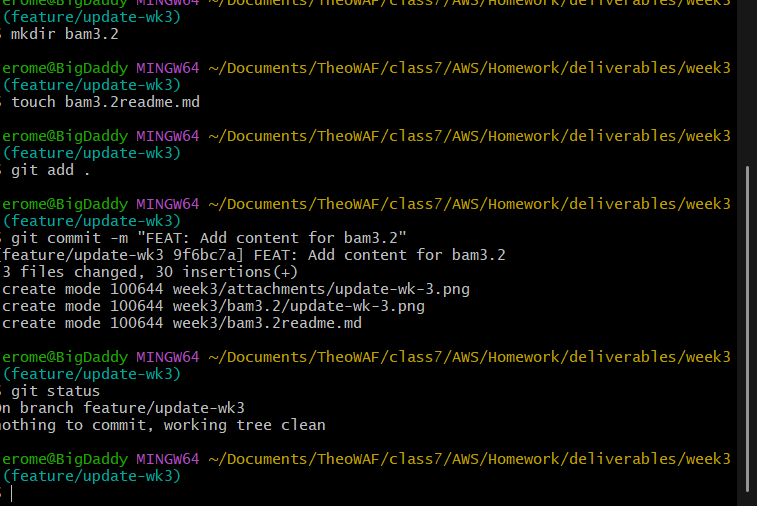
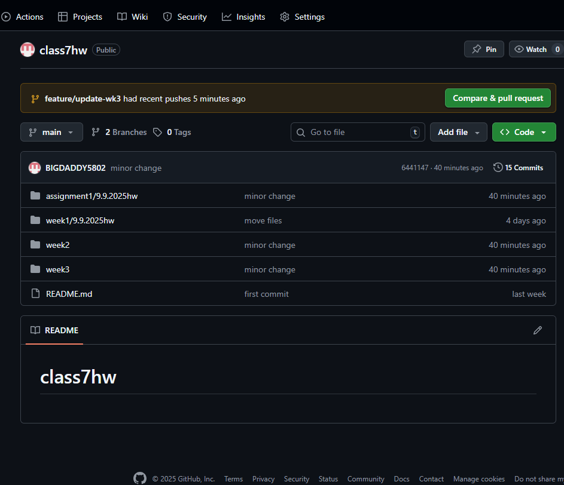
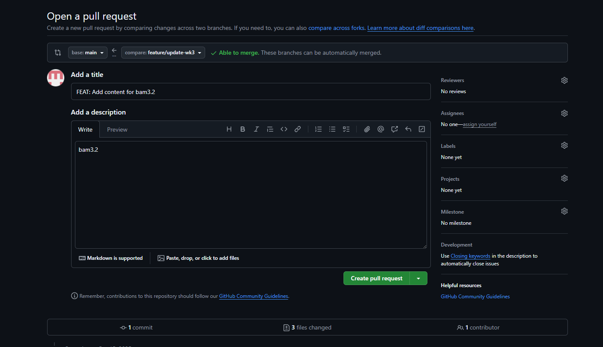
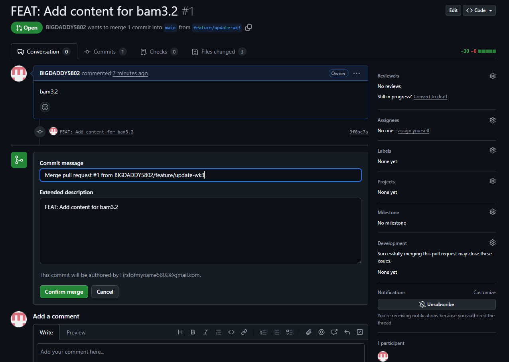
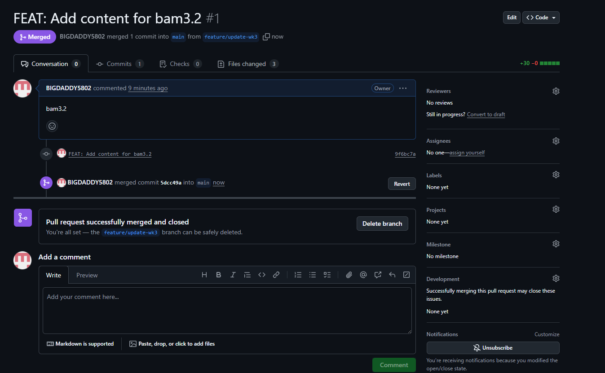
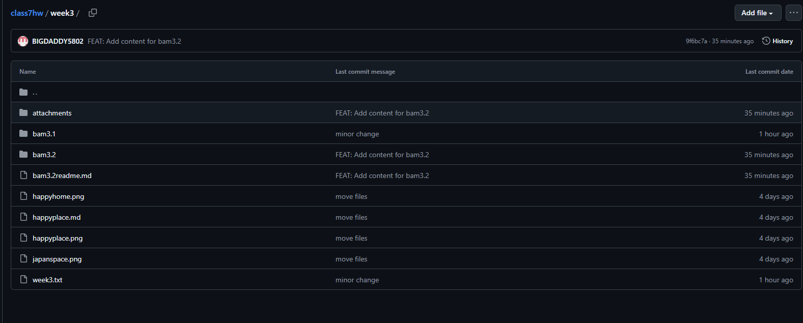
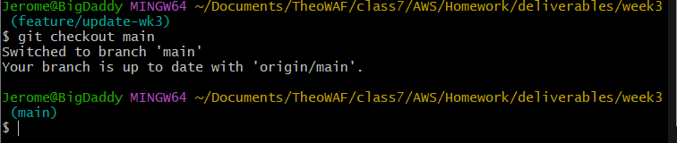
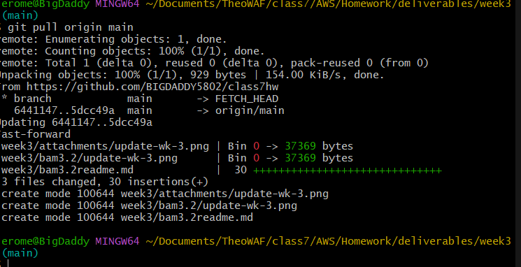

 ## Merge Request Instructions (github)

 Follow these steps for a successful merge request

 ### Step 1: Create Branch

 Create local branch in your projects main directory from your machine to hold changes away from remote repo.

 '''
 # This creates new branch called "feature/update-wk3"
git checkout -b feature/update-wk1
```



### Step 2: Make your changes

Make necessary changes in directory or file, for example, add a file or a picture or some instructions. bam3.2 dir add some screenshots of your work and explain how you did it.

### Step 3: Stage and commit

Save work on branches history.

```
# Stage all new and modified files for commit
git add .

# Commit the staged files with a descriptive message
git commit -m "FEAT: Add content for bam3.2"
```



### Step 4: Push to Github

Send new branch to github with commits already in remote repository, though not connected to the main.

```
# Push the branch and set up remote tracking
git push -u origin feature/update-wk3
```


### Step 5: Create Pull Request

Go to your repository on github, there will be a yellow notification bar with the new branch prompting you to "compare & pull request"! ->Click --> Compare & pull request <--
You will be taken to a screen where you name the pull request, and also describe it.



### Step 6: Merge pull request

You are now looking at all the changes you have made to your branch that you are about to merge into the main branch, does it look good? Will it comflict with anything? The team will need yours to work or you could break the pipeline.

Click -> Create pull request <-


Click -> Confirm merge <-


Success!!!!


Confirm merge in repo ' new file alert: be a man 3.2 is in the repo '


### Step 7: Clean up

After merge you should see a delete branch button next to your successful pull request.
It is good practice to delete the new branch after the merge. -> Delete

---
## Post Merge branch Cleanup

This procedure outlines the necessary steps to synchronize your local repo and remove the branch(s) no longer in use, after a feature/temporary branch has been successfully merged into the `main` branch on the remote repository.

### Step 1: Return to Main Branch

In present working directory switch back to 'main' branch. Be mindful that the main branch is always priority in the project. Remains ground zero for any changes.


```
# switch back to main branch
git checkout main
```


### Step 2: Synchronize Local Branch (Main)

Update local 'main' branch to also include changes done on remote repo ('origin'). This brings local version up to date with remote version.

```
git pull origin main
```



### Step 3: Delete the Local Feature Branch

Remove the branch that you created, the feature branch is now part of the main branch therefore we no longer need feature branch.

```
# delete branch
git branch -d feature/update-wk3
```

**Note:** Use the `-d` (delete) flag for this operation. Git will prevent deletion if the branch contains unmerged changes, acting as a safety measure. Forcing a deletion requires the `-D` flag.


